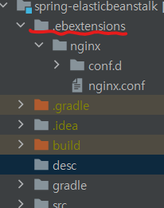
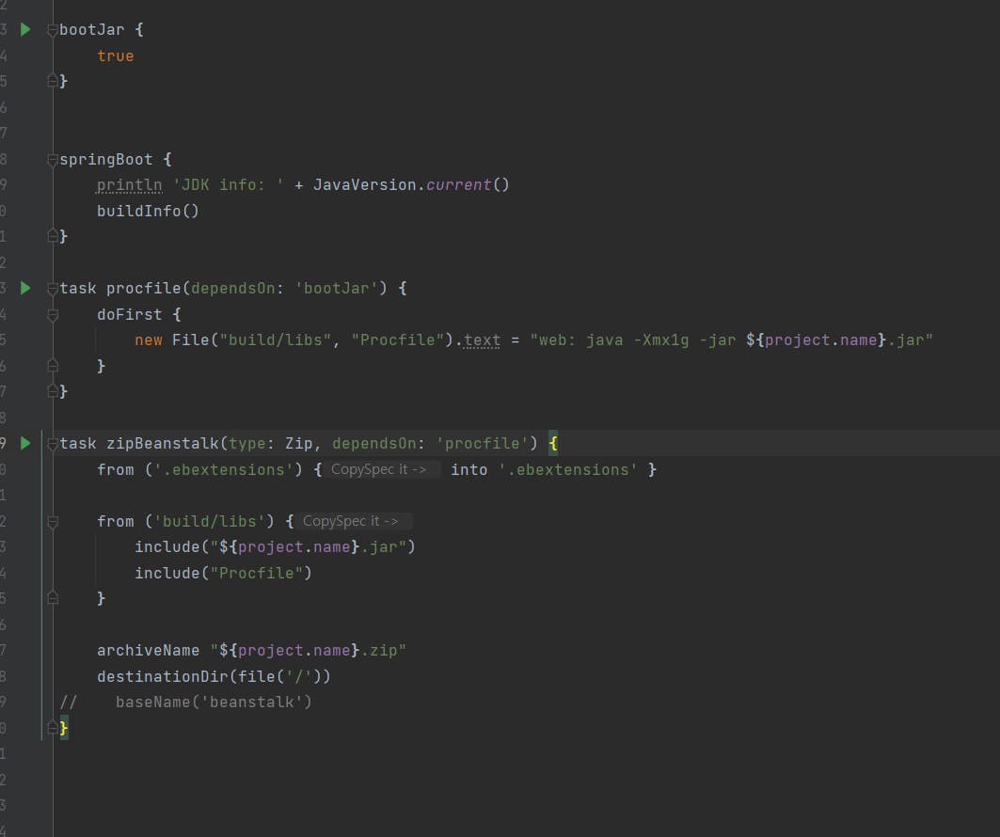

# spring-elasticbeanstalk

[AWS Elastic Beanstalk 설명서](https://docs.aws.amazon.com/ko_kr/elastic-beanstalk/?id=docs_gateway) 참고하여, spring boot elasticbeanstalk 초기 설정을 공부한다.
1. 목적 : 레거시 프로젝트가 python + elasticbeanstalk 으로 구성되어 있어, 구조 파악을 위함
2. 추가 참고 레퍼런스
   1. [Github Action & AWS Beanstalk 배포하기](https://jojoldu.tistory.com/549)
   2. [Spring boot .ebextensions nginx 및 기본 사용방법](https://wky.kr/45)
   3. [Java Jar 파일을 통한 Web Application Deploy](https://browndwarf.tistory.com/66) 

## Spring boot에서 AWS Elastic Beanstalk 사용시 .ebextensions 사용하는 방법
* .ebextensions 폴더를 프로젝트 최상위에 생성
  * 
* 이 후 서버에 적용하고 싶은 값들을 .conf 확장자로 만들어 .ebextensions 폴더에 넣으면 됨
  * 예시 : nginx
  

## 배포 설정
* bootJar 로 만들어진 배포 파일을 포함한 elasticbeanstalk 배포 파일을 spring-elasticbeanstalk.zip 으로 만듬
  * 
  spring boot는 OCI Image를 빌드하는 방법을 제공한다. OCI는 컨테이너 기술의 표준과 같은 개념인듯.

## AWS Console 접근하여 Elasticbeanstalk 생성 및 zip 파일 업로드
* 배포 완료되면 ec2 생성되고 터미널 접근 가능하다.

